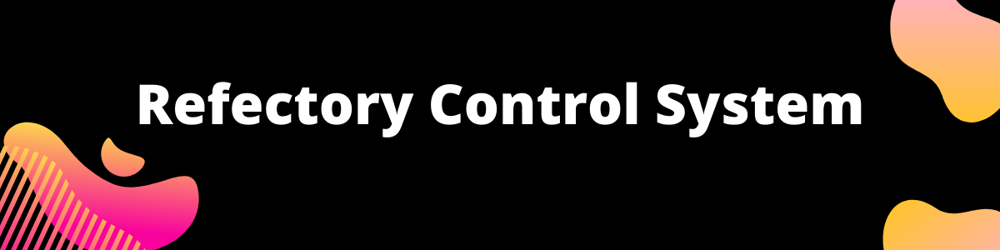

# Refectory Control System

RefectoryControl e um software de gerenciamento de refeitórios feito para o Instituto Federal do Piauí em 2018, devido a incompatibilidade de licenças entre o IFPI e GPL este projeto foi criado.
Junto o software que seria entregue ao Instituto foi extraido um framework chamado Zatron System Framework com o qual esse foi (Na medida do possível) criado.

# O que é o zatron system framework?

E um micro framework web em php para prototipagem e criação de micro sistemas. como sistemas que tenham uma unica função como por exemplo um sistema de cadastre telefones e marque licações. O zatron também server para prototipagem de sistemas em php vanila.

